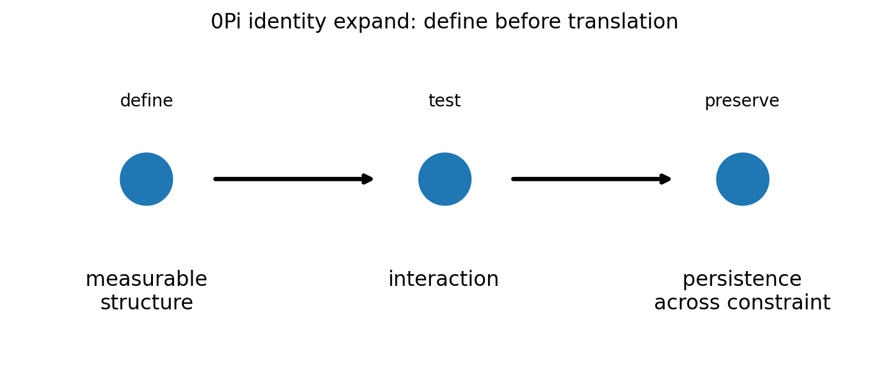
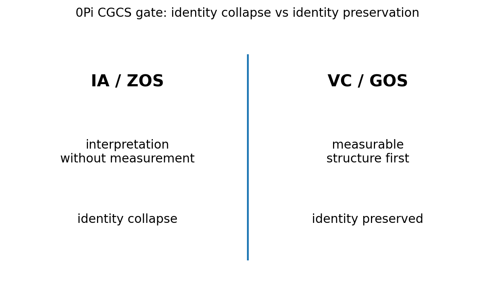

# 00 — 0Pi Identity Expand Notes

## Core statement

0Pi establishes identity before interpretation.

## Identity triplet

- 0Pi: define measurable identity
- 1Pi: test identity through interaction
- 2Pi: preserve identity across constraint

## Figures

### Identity expansion

### CGCS gate (VC/GOS vs IA/ZOS)

## Results

### Metadata
- results/00_0Pi_metadata.json

### Claim scoring
- results/00_0Pi_claims.json
- results/00_0Pi_claims.csv

### Manifest
- results/00_0Pi_manifest.json

## Template use

This notebook should be cloned for later Pi stages. Keep the same output pattern:

- docs/*.md for human-readable bridge notes
- results/*.json and results/*.csv for machine-readable claim scoring
- results/*_manifest.json for output inventory
- figures/*.png for site, paper, and seminar visuals
- math/*.tex for formal paper-ready equations

## Translation boundary

0Pi is grammar, not application.

Photons, CO2, O2, carbon cycle, climate claims, and public-language examples should be added in bridge docs or later notebooks, not hard-coded into 0Pi.

## High-CGCS 0Pi framing

A system identity should be defined by measurable structure before interpretation.

## Low-CGCS 0Pi collapse

A single slogan is enough to define a physical system.
