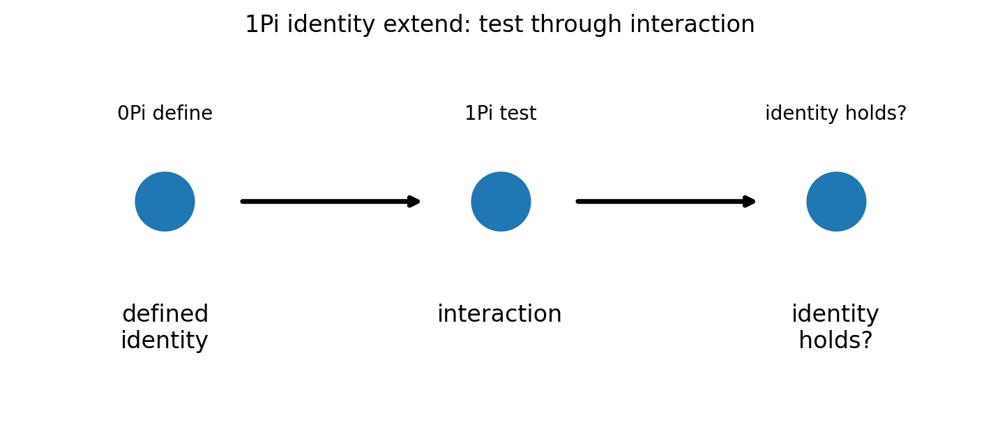
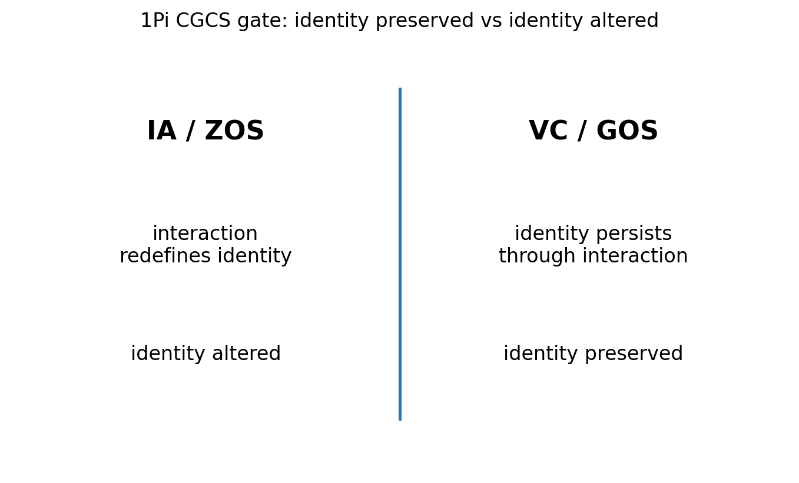

# 01 — 1Pi Identity Extend Notes

## Core statement

1Pi tests identity through interaction.

## Identity triplet

- 0Pi: define measurable identity
- 1Pi: test identity through interaction
- 2Pi: preserve identity across constraint

## Identity test

1Pi applies interaction and evaluates persistence.

A valid identity:
- remains consistent under measurement
- persists through transformation
- separates observation from identity

An invalid identity:
- changes definition under interaction
- collapses into interpretation
- replaces measurement with public-language shortcut

## Figures

### Identity through interaction

### CGCS gate (VC/GOS vs IA/ZOS)

## Results

### Metadata
- [01_1Pi_metadata.json](../results/01_1Pi_metadata.json)

### Claim scoring
- [01_1Pi_claims.json](../results/01_1Pi_claims.json)
- [01_1Pi_claims.csv](../results/01_1Pi_claims.csv)

### Manifest
- [01_1Pi_manifest.json](../results/01_1Pi_manifest.json)

## Template use

This notebook should be cloned for later Pi stages. Keep the same output pattern:

- docs/*.md for human-readable bridge notes
- results/*.json and results/*.csv for machine-readable claim scoring
- results/*_manifest.json for output inventory
- figures/*.png for site, paper, and seminar visuals
- math/*.tex for formal paper-ready equations

## Translation boundary

1Pi is grammar, not application.

Photons, CO2, O2, carbon cycle, climate claims, and public-language examples should be added in bridge docs or later notebooks, not hard-coded into 1Pi.

## High-CGCS 1Pi framing

A valid identity remains consistent through interaction.

## Low-CGCS 1Pi collapse

Interaction redefines identity without measurement.
