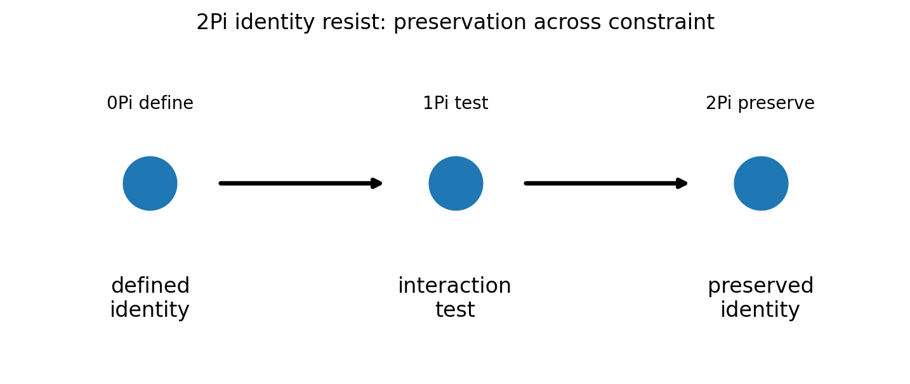
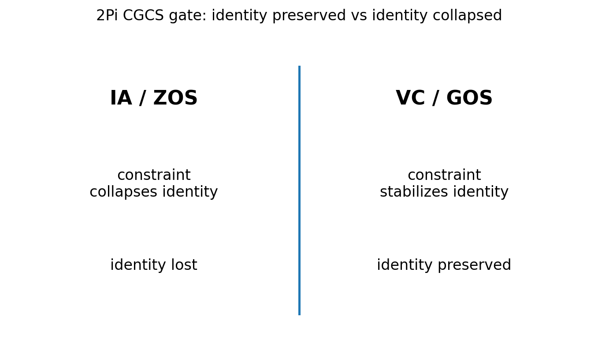

# 02 — 2Pi Identity Resist Notes

## Core statement

2Pi preserves identity across constraint pressure.

## Identity triplet

- 0Pi: define measurable identity
- 1Pi: test identity through interaction
- 2Pi: preserve identity across constraint

## Preservation gate

2Pi completes the first identity triplet.

A valid identity:
- remains stable across constraint
- preserves measurable continuity
- resists collapse into interpretation

An invalid identity:
- treats constraint as erasure
- loses measurable continuity
- replaces preserved structure with public-language shortcut

## Figures

### Identity across constraint

### CGCS gate (VC/GOS vs IA/ZOS)

## Results

### Metadata
- [02_2Pi_metadata.json](../results/02_2Pi_metadata.json)

### Claim scoring
- [02_2Pi_claims.json](../results/02_2Pi_claims.json)
- [02_2Pi_claims.csv](../results/02_2Pi_claims.csv)

### Manifest
- [02_2Pi_manifest.json](../results/02_2Pi_manifest.json)

## Template use

This notebook should be cloned for later Pi stages. Keep the same output pattern:

- docs/*.md for human-readable bridge notes
- results/*.json and results/*.csv for machine-readable claim scoring
- results/*_manifest.json for output inventory
- figures/*.png for site, paper, and seminar visuals
- math/*.tex for formal paper-ready equations

## Translation boundary

2Pi is grammar, not application.

Photons, CO2, O2, carbon cycle, climate claims, and public-language examples should be added in bridge docs or later notebooks, not hard-coded into 2Pi.

## High-CGCS 2Pi framing

A valid identity is preserved across constraint pressure.

## Low-CGCS 2Pi collapse

Constraint pressure erases identity.
