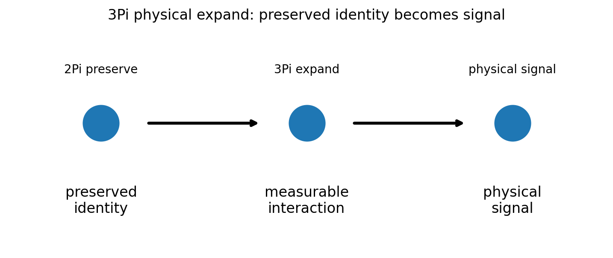
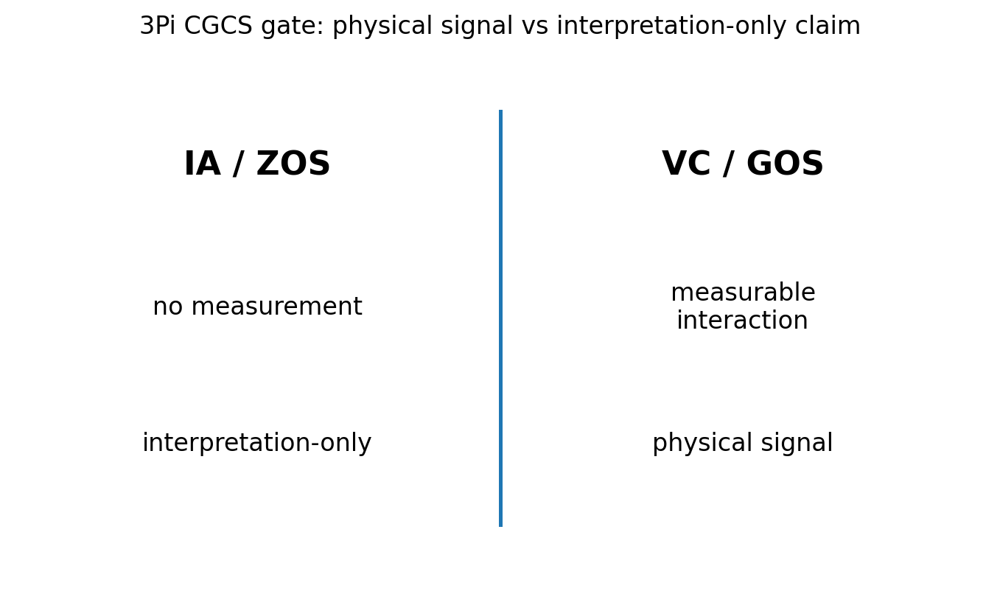

# 03 — 3Pi Physical Expand Notes

## Core statement

3Pi expands preserved identity into measurable physical interaction.

## Physical triplet

- 3Pi: expand preserved identity into measurable interaction
- 4Pi: extend physical interaction through variable change
- 5Pi: resist physical collapse by preserving signal across constraint

## Physical expansion

3Pi begins the physical triplet.

A valid physical claim:
- begins from preserved identity
- introduces measurable interaction
- produces a physical signal

An invalid physical claim:
- skips measurement
- treats interpretation as physical behavior
- disconnects identity from interaction

## Figures

### Physical expansion

### CGCS gate (VC/GOS vs IA/ZOS)

## Results

### Metadata
- [03_3Pi_metadata.json](../results/03_3Pi_metadata.json)

### Claim scoring
- [03_3Pi_claims.json](../results/03_3Pi_claims.json)
- [03_3Pi_claims.csv](../results/03_3Pi_claims.csv)

### Manifest
- [03_3Pi_manifest.json](../results/03_3Pi_manifest.json)

## Template use

This notebook should be cloned for later Pi stages. Keep the same output pattern:

- docs/*.md for human-readable bridge notes
- results/*.json and results/*.csv for machine-readable claim scoring
- results/*_manifest.json for output inventory
- figures/*.png for site, paper, and seminar visuals
- math/*.tex for formal paper-ready equations

## Translation boundary

3Pi is grammar, not application.

Photons, CO2, O2, carbon cycle, climate claims, and public-language examples should be added in bridge docs or later notebooks, not hard-coded into 3Pi.

## High-CGCS 3Pi framing

A preserved identity becomes physically meaningful through measurable interaction.

## Low-CGCS 3Pi collapse

Physical meaning can be assigned without measurable interaction.
