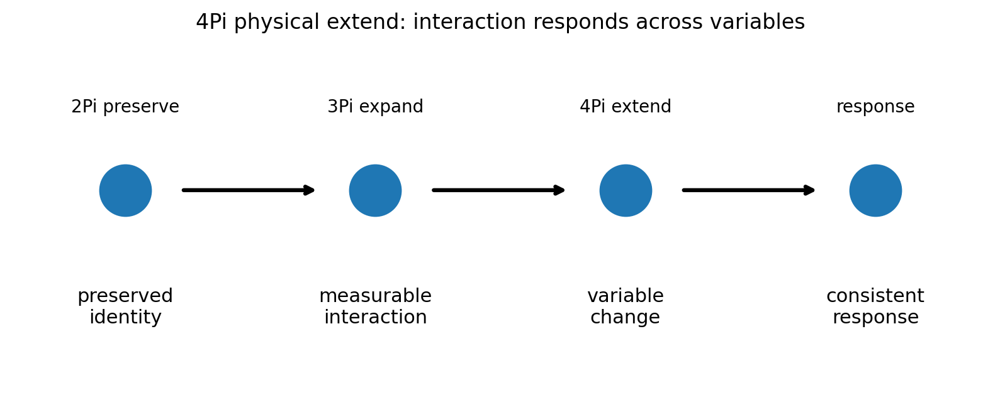
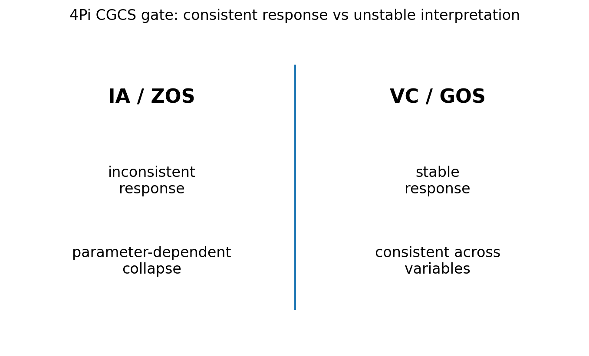

# 04 — 4Pi Physical Extend Notes

## Core statement

4Pi extends physical interaction across variable space.

## Physical triplet

- 3Pi: expand preserved identity into measurable interaction
- 4Pi: extend physical interaction through variable change
- 5Pi: resist physical collapse by preserving signal across constraint

## Physical extension

4Pi extends physical interaction across variable space.

A valid physical system:
- responds consistently to variable change
- maintains structure across parameter variation
- produces stable measurable behavior

An invalid system:
- changes unpredictably
- collapses under variation
- replaces physical behavior with interpretation

## Figures

### Physical extension through variables

### CGCS gate (VC/GOS vs IA/ZOS)

## Results

### Metadata
- [04_4Pi_metadata.json](../results/04_4Pi_metadata.json)

### Claim scoring
- [04_4Pi_claims.json](../results/04_4Pi_claims.json)
- [04_4Pi_claims.csv](../results/04_4Pi_claims.csv)

### Manifest
- [04_4Pi_manifest.json](../results/04_4Pi_manifest.json)

## Template use

This notebook should be cloned for later Pi stages. Keep the same output pattern:

- docs/*.md for human-readable bridge notes
- results/*.json and results/*.csv for machine-readable claim scoring
- results/*_manifest.json for output inventory
- figures/*.png for site, paper, and seminar visuals
- math/*.tex for formal paper-ready equations

## Translation boundary

4Pi is grammar, not application.

Photons, CO2, O2, carbon cycle, climate claims, and public-language examples should be added in bridge docs or later notebooks, not hard-coded into 4Pi.

## High-CGCS 4Pi framing

A valid physical interaction remains consistent under variable change.

## Low-CGCS 4Pi collapse

A single observation is sufficient to define a physical system.
