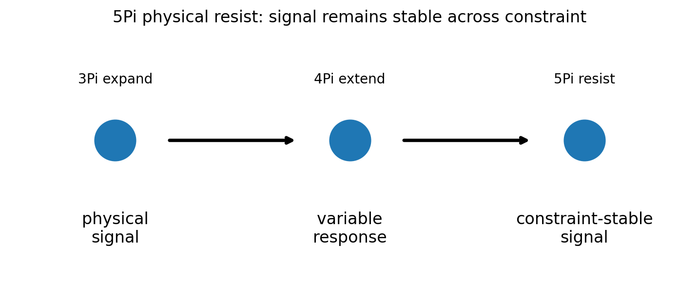
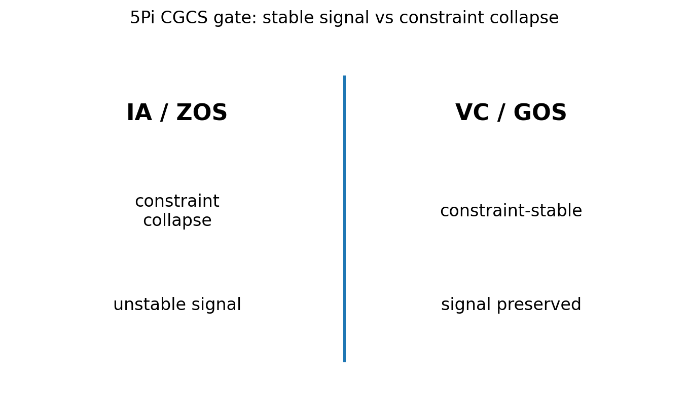

# 05 — 5Pi Physical Resist Notes

## Core statement

5Pi preserves physical signal across constraint pressure.

## Physical triplet

- 3Pi: expand preserved identity into measurable interaction
- 4Pi: extend physical interaction through variable change
- 5Pi: resist physical collapse by preserving signal across constraint

## Physical resistance

5Pi completes the physical triplet.

A valid physical signal:
- remains stable across constraint pressure
- preserves measurable response
- passes a constraint gate

An invalid physical signal:
- collapses under constraint
- treats unstable measurements as stable
- replaces constraint validation with interpretation

## Generic 45-degree gate

The generic stability gate is:

```tex
\cos(	heta) \geq rac{1}{\sqrt{1^2 + 1^2}}
```

## Figures

### Physical resistance through constraint


### CGCS gate (VC/GOS vs IA/ZOS)


## Results

### Metadata
- [05_5Pi_metadata.json](../results/05_5Pi_metadata.json)

### Claim scoring
- [05_5Pi_claims.json](../results/05_5Pi_claims.json)
- [05_5Pi_claims.csv](../results/05_5Pi_claims.csv)

### Manifest
- [05_5Pi_manifest.json](../results/05_5Pi_manifest.json)

## Template use

This notebook should be cloned for later Pi stages. Keep the same output pattern:

- docs/*.md for human-readable bridge notes
- results/*.json and results/*.csv for machine-readable claim scoring
- results/*_manifest.json for output inventory
- figures/*.png for site, paper, and seminar visuals
- math/*.tex for formal paper-ready equations

## Translation boundary

5Pi is grammar, not application.

Photons, CO2, O2, carbon cycle, climate claims, and public-language examples should be added in bridge docs or later notebooks, not hard-coded into 5Pi.

## High-CGCS 5Pi framing

A valid physical signal remains stable across constraint pressure.

## Low-CGCS 5Pi collapse

Unstable measurements can be treated as stable physical behavior.
