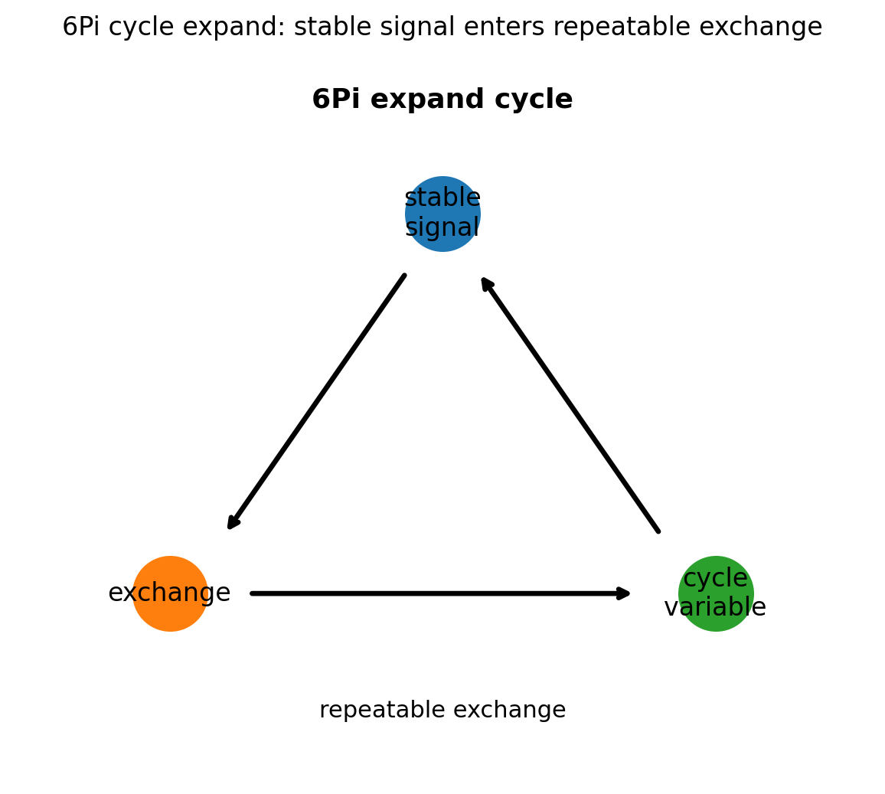
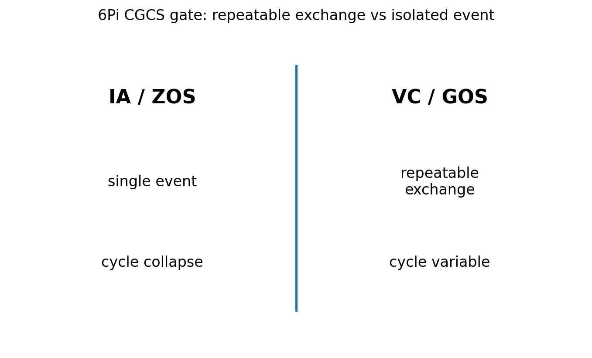

# 06 — 6Pi Cycle Expand Notes

## Core statement

6Pi expands stable physical signal into repeatable cycle exchange.

## Cycle triplet

- 6Pi: expand stable physical signal into repeatable cycle exchange
- 7Pi: extend cycle exchange through rates, reservoirs, or pathways
- 8Pi: resist cycle collapse by preserving exchange under constraint

## Cycle expansion

6Pi begins the cycle triplet.

A valid cycle:
- begins from stable physical signal
- introduces repeatable exchange
- identifies a measurable cycle variable

An invalid cycle:
- treats one event as a cycle
- skips repeatable exchange
- replaces system transfer with interpretation

## Figures

### Cycle expansion

### CGCS gate (VC/GOS vs IA/ZOS)

## Results

### Metadata
- [06_6Pi_metadata.json](../results/06_6Pi_metadata.json)

### Claim scoring
- [06_6Pi_claims.json](../results/06_6Pi_claims.json)
- [06_6Pi_claims.csv](../results/06_6Pi_claims.csv)

### Manifest
- [06_6Pi_manifest.json](../results/06_6Pi_manifest.json)

## Template use

This notebook should be cloned for later Pi stages. Keep the same output pattern:

- docs/*.md for human-readable bridge notes
- results/*.json and results/*.csv for machine-readable claim scoring
- results/*_manifest.json for output inventory
- figures/*.png for site, paper, and seminar visuals
- math/*.tex for formal paper-ready equations

## Translation boundary

6Pi is grammar, not application.

Photons, CO2, O2, carbon cycle, climate claims, and public-language examples should be added in bridge docs or later notebooks, not hard-coded into 6Pi.

## High-CGCS 6Pi framing

A stable physical signal becomes a cycle variable through repeatable exchange.

## Low-CGCS 6Pi collapse

A cycle can be defined from a single non-repeatable event.
