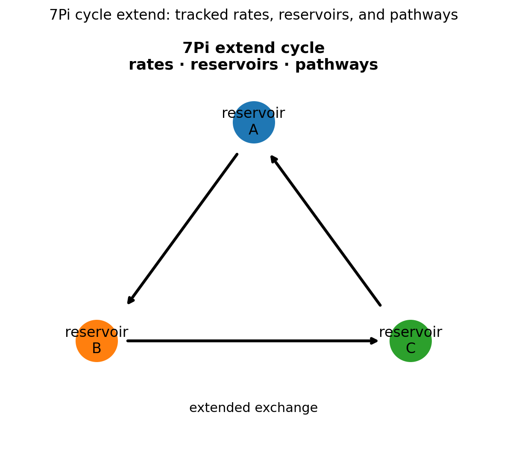
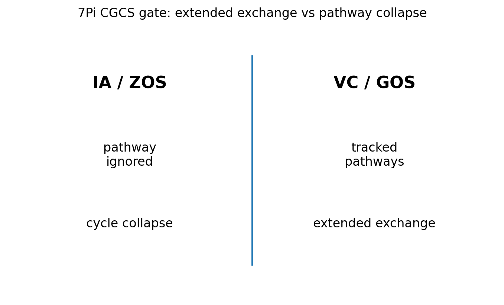

# 07 — 7Pi Cycle Extend Notes

## Core statement

7Pi extends cycle exchange across rates, reservoirs, and pathways.

## Cycle triplet

- 6Pi: expand stable physical signal into repeatable cycle exchange
- 7Pi: extend cycle exchange through rates, reservoirs, or pathways
- 8Pi: resist cycle collapse by preserving exchange under constraint

## Cycle extension

7Pi extends cycle exchange across rates, reservoirs, and pathways.

A valid cycle:
- tracks rates
- identifies reservoirs
- preserves pathways of exchange
- extends repeatable transfer across structured variation

An invalid cycle:
- ignores pathways
- treats reservoir shifts as arbitrary
- replaces measurable transfer with interpretation
- claims cycle behavior without tracking exchange

## Figures

### Cycle extension

### CGCS gate (VC/GOS vs IA/ZOS)

## Results

### Metadata
- [07_7Pi_metadata.json](../results/07_7Pi_metadata.json)

### Claim scoring
- [07_7Pi_claims.json](../results/07_7Pi_claims.json)
- [07_7Pi_claims.csv](../results/07_7Pi_claims.csv)

### Manifest
- [07_7Pi_manifest.json](../results/07_7Pi_manifest.json)

## Template use

This notebook should be cloned for later Pi stages. Keep the same output pattern:

- docs/*.md for human-readable bridge notes
- results/*.json and results/*.csv for machine-readable claim scoring
- results/*_manifest.json for output inventory
- figures/*.png for site, paper, and seminar visuals
- math/*.tex for formal paper-ready equations

## Translation boundary

7Pi is grammar, not application.

Photons, CO2, O2, carbon cycle, climate claims, and public-language examples should be added in bridge docs or later notebooks, not hard-coded into 7Pi.

## High-CGCS 7Pi framing

A valid cycle remains consistent across rates, reservoirs, and pathways.

## Low-CGCS 7Pi collapse

A cycle can be explained without tracking pathways.
