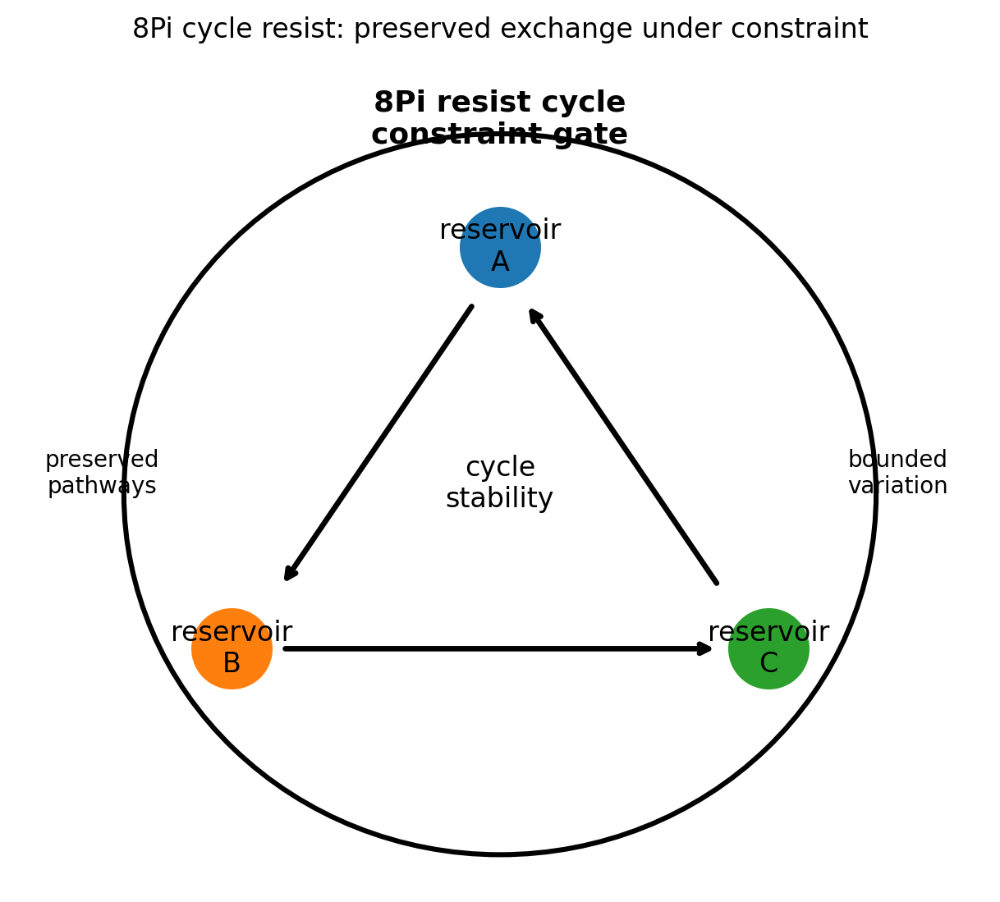
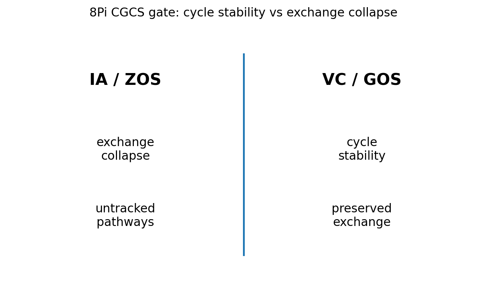

# 08 — 8Pi Cycle Resist Notes

## Core statement

8Pi preserves cycle exchange under constraint pressure.

## Cycle triplet

- 6Pi: expand stable physical signal into repeatable cycle exchange
- 7Pi: extend cycle exchange through rates, reservoirs, or pathways
- 8Pi: resist cycle collapse by preserving exchange under constraint

## Cycle resistance

8Pi completes the cycle triplet.

A valid cycle:
- preserves exchange under constraint
- maintains pathways
- keeps variation bounded
- remains measurable as a cycle

An invalid cycle:
- collapses under constraint
- loses pathways
- treats untracked exchange as valid
- replaces cycle stability with interpretation

## Figures

### Cycle resistance

### CGCS gate (VC/GOS vs IA/ZOS)

## Results

### Metadata
- [08_8Pi_metadata.json](../results/08_8Pi_metadata.json)

### Claim scoring
- [08_8Pi_claims.json](../results/08_8Pi_claims.json)
- [08_8Pi_claims.csv](../results/08_8Pi_claims.csv)

### Manifest
- [08_8Pi_manifest.json](../results/08_8Pi_manifest.json)

## Template use

This notebook should be cloned for later Pi stages. Keep the same output pattern:

- docs/*.md for human-readable bridge notes
- results/*.json and results/*.csv for machine-readable claim scoring
- results/*_manifest.json for output inventory
- figures/*.png for site, paper, and seminar visuals
- math/*.tex for formal paper-ready equations

## Translation boundary

8Pi is grammar, not application.

Photons, CO2, O2, carbon cycle, climate claims, and public-language examples should be added in bridge docs or later notebooks, not hard-coded into 8Pi.

## High-CGCS 8Pi framing

A valid cycle preserves exchange under constraint pressure.

## Low-CGCS 8Pi collapse

A cycle remains valid even when pathways cannot be tracked.
