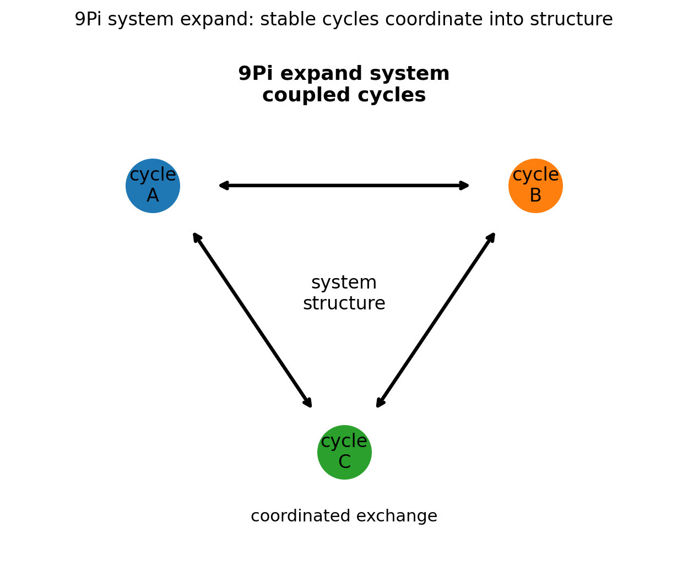
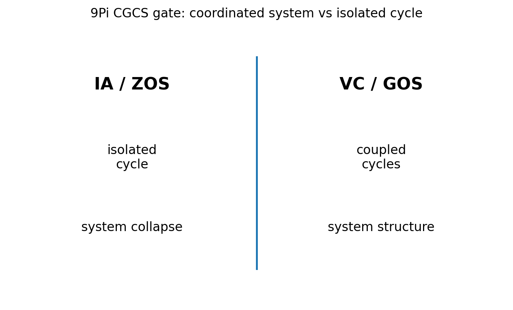

# 09 — 9Pi System Expand Notes

## Core statement

9Pi expands stable cycle exchange into coordinated system structure.

## System triplet

- 9Pi: expand stable cycle exchange into coordinated system structure
- 10Pi: extend system structure across scale, coupling strength, and feedback
- 11Pi: resist system collapse by preserving coordination under constraint

## System expansion

9Pi begins the system triplet.

A valid system:
- begins from stable cycles
- coordinates multiple exchanges
- forms structure from coupled behavior
- preserves measurable relationships among interacting cycles

An invalid system:
- treats one isolated cycle as a system
- ignores coupling
- replaces coordinated exchange with interpretation
- claims system behavior without interacting components

## Figures

### System expansion

### CGCS gate (VC/GOS vs IA/ZOS)

## Results

### Metadata
- [09_9Pi_metadata.json](../results/09_9Pi_metadata.json)

### Claim scoring
- [09_9Pi_claims.json](../results/09_9Pi_claims.json)
- [09_9Pi_claims.csv](../results/09_9Pi_claims.csv)

### Manifest
- [09_9Pi_manifest.json](../results/09_9Pi_manifest.json)

## Template use

This notebook should be cloned for later Pi stages. Keep the same output pattern:

- docs/*.md for human-readable bridge notes
- results/*.json and results/*.csv for machine-readable claim scoring
- results/*_manifest.json for output inventory
- figures/*.png for site, paper, and seminar visuals
- math/*.tex for formal paper-ready equations

## Translation boundary

9Pi is grammar, not application.

Photons, CO2, O2, carbon cycle, climate claims, and public-language examples should be added in bridge docs or later notebooks, not hard-coded into 9Pi.

## High-CGCS 9Pi framing

A stable cycle becomes a system when multiple constrained exchanges coordinate.

## Low-CGCS 9Pi collapse

A system can be defined by one isolated cycle alone.
