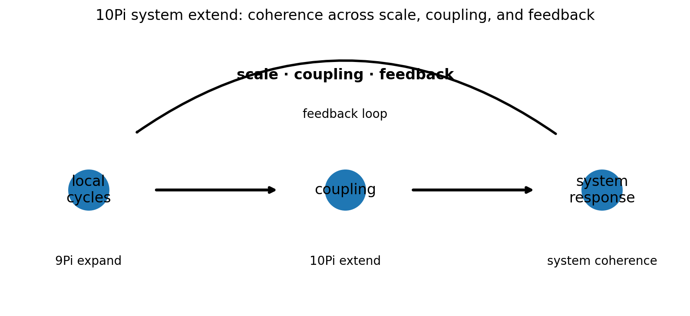
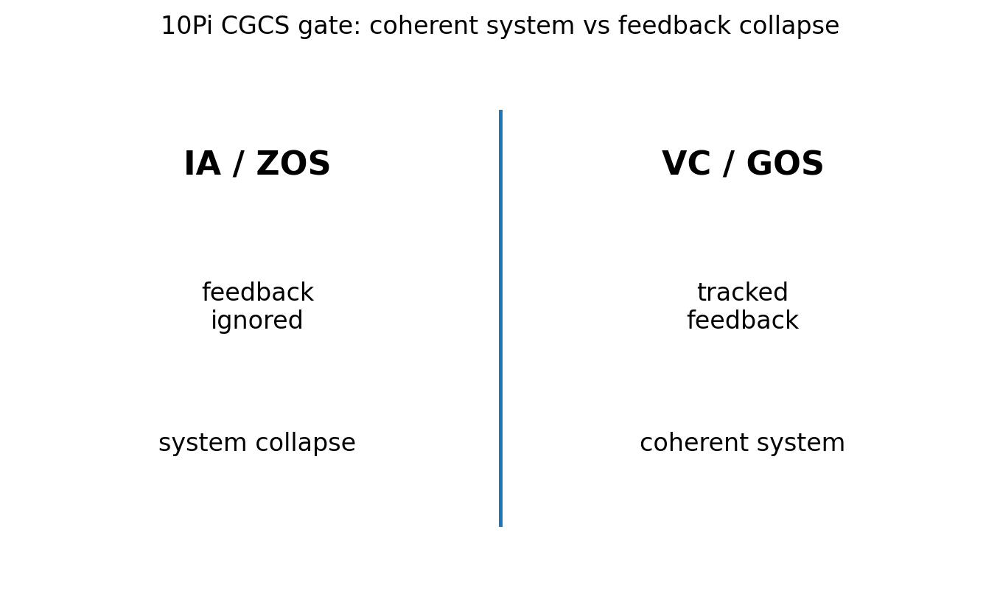

# 10 — 10Pi System Extend Notes

## Core statement

10Pi extends system structure across scale, coupling strength, and feedback.

## System triplet

- 9Pi: expand stable cycle exchange into coordinated system structure
- 10Pi: extend system structure across scale, coupling strength, and feedback
- 11Pi: resist system collapse by preserving coordination under constraint

## System extension

10Pi extends system structure across scale, coupling strength, and feedback.

A valid system:
- tracks scale
- measures coupling strength
- identifies feedback pathways
- preserves coherence across variation

An invalid system:
- ignores feedback
- treats scale changes as arbitrary
- removes coupling from system behavior
- replaces coherence with interpretation

## Figures

### System extension

### CGCS gate (VC/GOS vs IA/ZOS)

## Results

### Metadata
- [10_10Pi_metadata.json](../results/10_10Pi_metadata.json)

### Claim scoring
- [10_10Pi_claims.json](../results/10_10Pi_claims.json)
- [10_10Pi_claims.csv](../results/10_10Pi_claims.csv)

### Manifest
- [10_10Pi_manifest.json](../results/10_10Pi_manifest.json)

## Template use

This notebook should be cloned for later Pi stages. Keep the same output pattern:

- docs/*.md for human-readable bridge notes
- results/*.json and results/*.csv for machine-readable claim scoring
- results/*_manifest.json for output inventory
- figures/*.png for site, paper, and seminar visuals
- math/*.tex for formal paper-ready equations

## Translation boundary

10Pi is grammar, not application.

Photons, CO2, O2, carbon cycle, climate claims, and public-language examples should be added in bridge docs or later notebooks, not hard-coded into 10Pi.

## High-CGCS 10Pi framing

A valid system remains coherent across scale, coupling strength, and feedback.

## Low-CGCS 10Pi collapse

A system can be explained without identifying feedback pathways.
