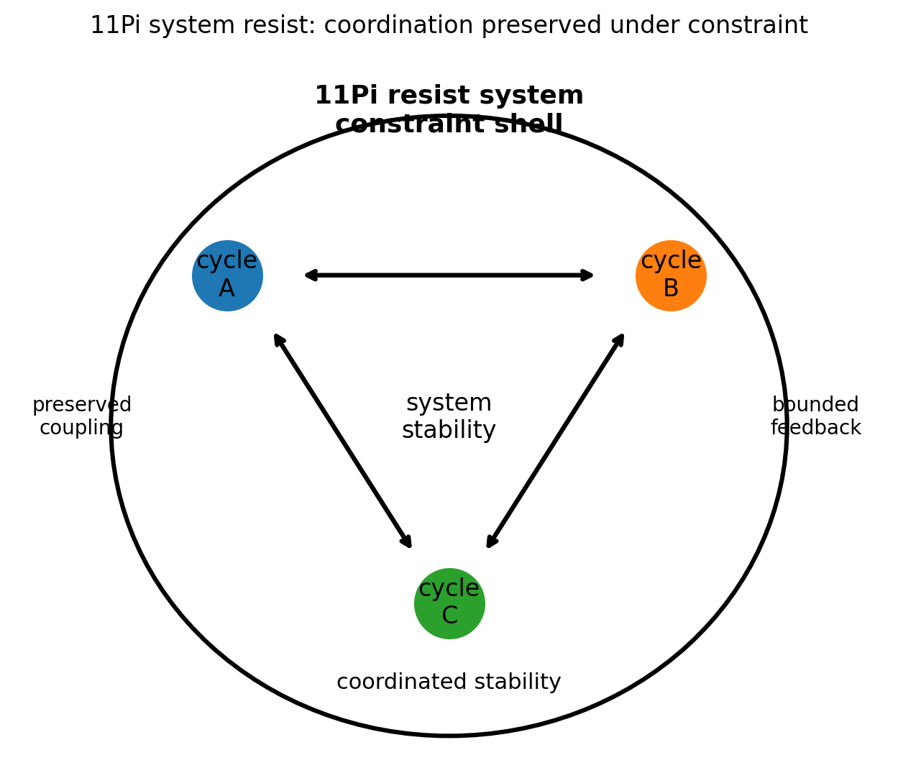
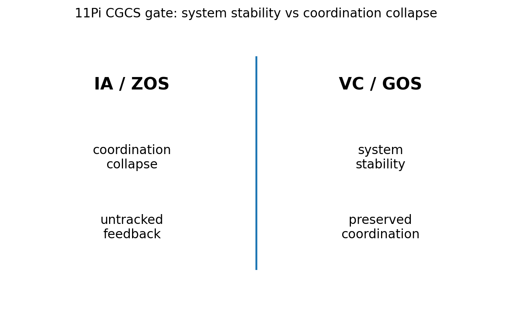

# 11 — 11Pi System Resist Notes

## Core statement

11Pi preserves system coordination under constraint pressure.

## System triplet

- 9Pi: expand stable cycle exchange into coordinated system structure
- 10Pi: extend system structure across scale, coupling strength, and feedback
- 11Pi: resist system collapse by preserving coordination under constraint

## System resistance

11Pi completes the system triplet.

A valid system:
- preserves coordination under constraint
- maintains coupling
- keeps feedback bounded
- remains coherent as a system

An invalid system:
- collapses under constraint
- loses coupling
- treats untracked feedback as valid
- replaces system stability with interpretation

## Figures

### System resistance

### CGCS gate (VC/GOS vs IA/ZOS)

## Results

### Metadata
- [11_11Pi_metadata.json](../results/11_11Pi_metadata.json)

### Claim scoring
- [11_11Pi_claims.json](../results/11_11Pi_claims.json)
- [11_11Pi_claims.csv](../results/11_11Pi_claims.csv)

### Manifest
- [11_11Pi_manifest.json](../results/11_11Pi_manifest.json)

## Template use

This notebook should be cloned for later Pi stages. Keep the same output pattern:

- docs/*.md for human-readable bridge notes
- results/*.json and results/*.csv for machine-readable claim scoring
- results/*_manifest.json for output inventory
- figures/*.png for site, paper, and seminar visuals
- math/*.tex for formal paper-ready equations

## Translation boundary

11Pi is grammar, not application.

Photons, CO2, O2, carbon cycle, climate claims, and public-language examples should be added in bridge docs or later notebooks, not hard-coded into 11Pi.

## High-CGCS 11Pi framing

A valid system preserves coordination under constraint pressure.

## Low-CGCS 11Pi collapse

A system remains valid even when coupling and feedback cannot be tracked.
