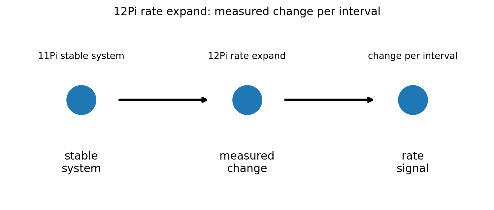
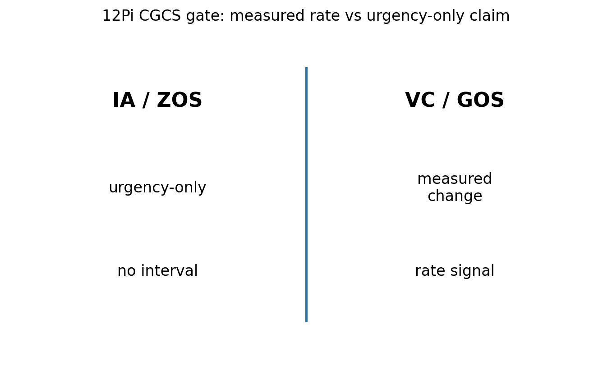

# 12 — 12Pi Rate Expand Notes

## Core statement

12Pi expands stable system behavior into measurable rates of change.

## Rate triplet

- 12Pi: expand stable system behavior into measurable rates of change
- 13Pi: extend rate across intervals, baselines, and comparisons
- 14Pi: resist rate collapse by preserving rate meaning under constraint

## Rate expansion

12Pi begins the rate triplet.

A valid rate:
- begins from stable system behavior
- measures change
- includes an interval
- produces a rate signal

An invalid rate:
- skips measured change
- omits interval
- replaces rate with urgency or interpretation

## Figures

### Rate expansion

### CGCS gate (VC/GOS vs IA/ZOS)

## Results

### Metadata
- [12_12Pi_metadata.json](../results/12_12Pi_metadata.json)

### Claim scoring
- [12_12Pi_claims.json](../results/12_12Pi_claims.json)
- [12_12Pi_claims.csv](../results/12_12Pi_claims.csv)

### Manifest
- [12_12Pi_manifest.json](../results/12_12Pi_manifest.json)

## Template use

This notebook should be cloned for later Pi stages. Keep the same output pattern:

- docs/*.md for human-readable bridge notes
- results/*.json and results/*.csv for machine-readable claim scoring
- results/*_manifest.json for output inventory
- figures/*.png for site, paper, and seminar visuals
- math/*.tex for formal paper-ready equations

## Translation boundary

12Pi is grammar, not application.

Photons, CO2, O2, carbon cycle, climate claims, and public-language examples should be added in bridge docs or later notebooks, not hard-coded into 12Pi.

## High-CGCS 12Pi framing

A stable system becomes rate-aware when change is measured per interval.

## Low-CGCS 12Pi collapse

Public urgency is enough to establish physical rate.
