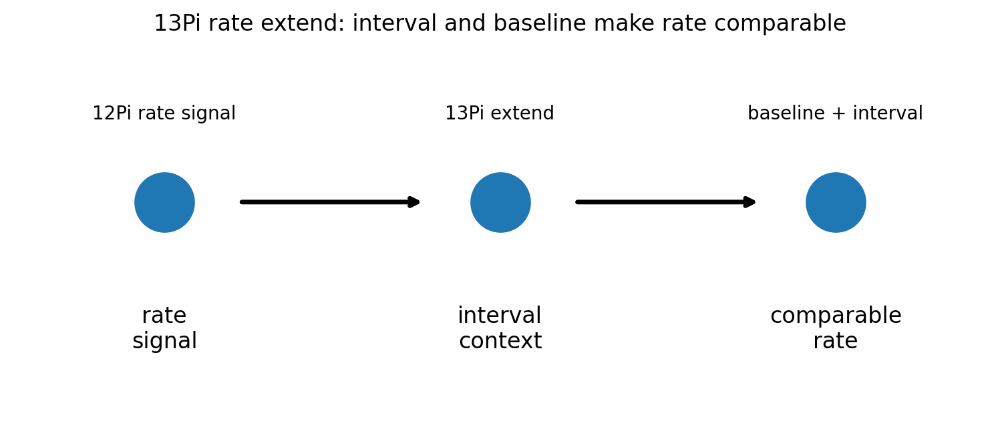
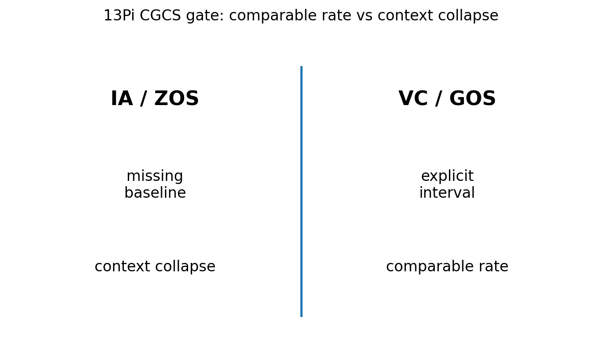

# 13 — 13Pi Rate Extend Notes

## Core statement

13Pi extends rate across intervals, baselines, and comparisons.

## Rate triplet

- 12Pi: expand stable system behavior into measurable rates of change
- 13Pi: extend rate across intervals, baselines, and comparisons
- 14Pi: resist rate collapse by preserving rate meaning under constraint

## Rate extension

13Pi extends rate across intervals, baselines, and comparisons.

A valid rate comparison:
- states interval
- states baseline
- preserves measurement context
- supports comparison

An invalid rate comparison:
- omits interval
- hides baseline
- treats context shifts as arbitrary
- replaces measurement with interpretation

## Figures

### Rate extension

### CGCS gate (VC/GOS vs IA/ZOS)

## Results

### Metadata
- [13_13Pi_metadata.json](../results/13_13Pi_metadata.json)

### Claim scoring
- [13_13Pi_claims.json](../results/13_13Pi_claims.json)
- [13_13Pi_claims.csv](../results/13_13Pi_claims.csv)

### Manifest
- [13_13Pi_manifest.json](../results/13_13Pi_manifest.json)

## Template use

This notebook should be cloned for later Pi stages. Keep the same output pattern:

- docs/*.md for human-readable bridge notes
- results/*.json and results/*.csv for machine-readable claim scoring
- results/*_manifest.json for output inventory
- figures/*.png for site, paper, and seminar visuals
- math/*.tex for formal paper-ready equations

## Translation boundary

13Pi is grammar, not application.

Photons, CO2, O2, carbon cycle, climate claims, and public-language examples should be added in bridge docs or later notebooks, not hard-coded into 13Pi.

## High-CGCS 13Pi framing

A valid rate remains meaningful across intervals, baselines, and comparisons.

## Low-CGCS 13Pi collapse

A rate can be compared without stating its baseline.
