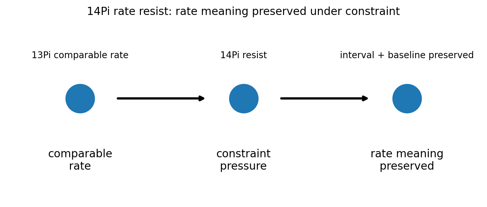
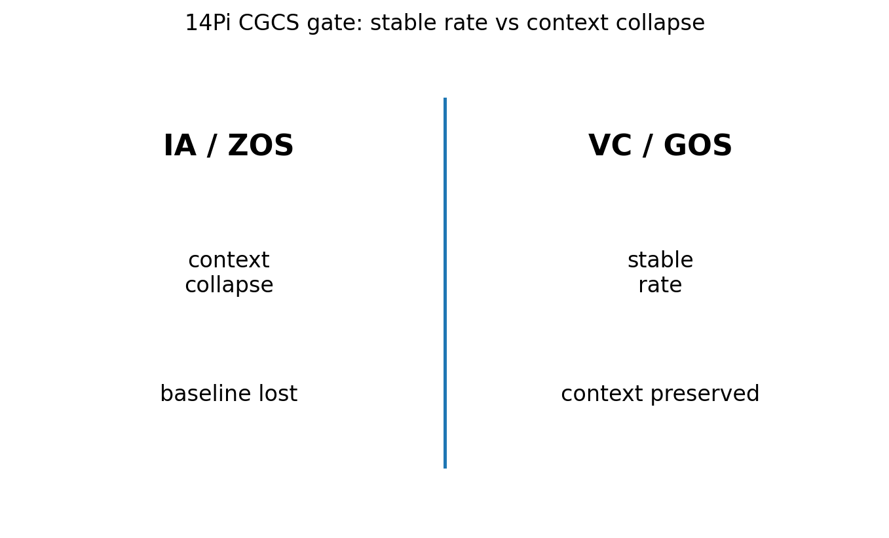

# 14 — 14Pi Rate Resist Notes

## Core statement

14Pi preserves rate meaning under constraint pressure.

## Rate triplet

- 12Pi: expand stable system behavior into measurable rates of change
- 13Pi: extend rate across intervals, baselines, and comparisons
- 14Pi: resist rate collapse by preserving rate meaning under constraint

## Rate resistance

14Pi completes the rate triplet.

A valid rate:
- preserves interval
- preserves baseline
- keeps variation bounded
- remains comparable under constraint

An invalid rate:
- loses interval
- hides baseline
- treats context collapse as comparison
- replaces rate stability with interpretation

## Figures

### Rate resistance

### CGCS gate (VC/GOS vs IA/ZOS)

## Results

### Metadata
- [14_14Pi_metadata.json](../results/14_14Pi_metadata.json)

### Claim scoring
- [14_14Pi_claims.json](../results/14_14Pi_claims.json)
- [14_14Pi_claims.csv](../results/14_14Pi_claims.csv)

### Manifest
- [14_14Pi_manifest.json](../results/14_14Pi_manifest.json)

## Template use

This notebook should be cloned for later Pi stages. Keep the same output pattern:

- docs/*.md for human-readable bridge notes
- results/*.json and results/*.csv for machine-readable claim scoring
- results/*_manifest.json for output inventory
- figures/*.png for site, paper, and seminar visuals
- math/*.tex for formal paper-ready equations

## Translation boundary

14Pi is grammar, not application.

Photons, CO2, O2, carbon cycle, climate claims, and public-language examples should be added in bridge docs or later notebooks, not hard-coded into 14Pi.

## High-CGCS 14Pi framing

A valid rate preserves meaning under constraint pressure.

## Low-CGCS 14Pi collapse

A rate remains valid even when interval and baseline are lost.
