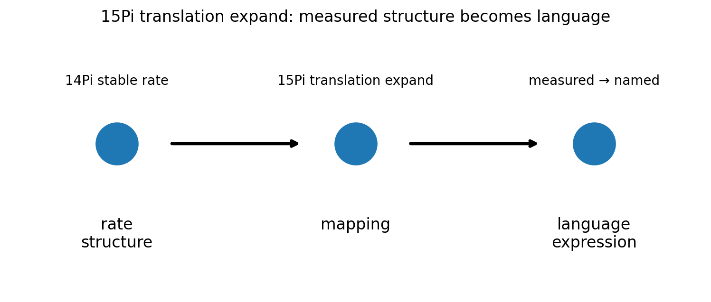
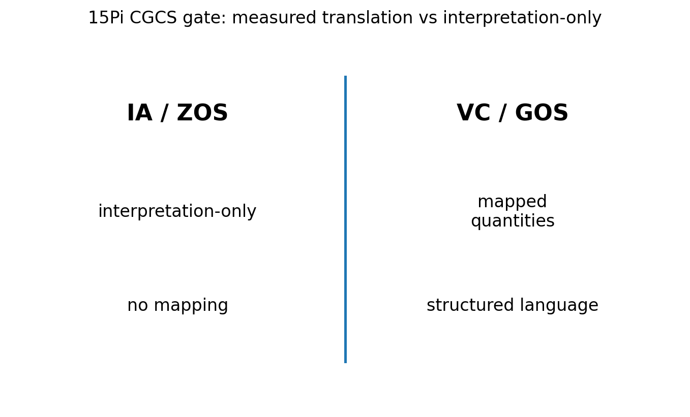

# 15 — 15Pi Translation Expand Notes

## Core statement

15Pi expands measurable rate structure into language while preserving meaning.

## Translation triplet

- 15Pi: expand measurable rate structure into mapped language
- 16Pi: extend translation across contexts, audiences, and representations
- 17Pi: resist translation collapse by preserving meaning in public language

## Translation expansion

15Pi begins the translation triplet.

A valid translation:
- maps measured quantities to language
- preserves interval and baseline context
- keeps structure intact
- produces interpretable but grounded expression

An invalid translation:
- skips mapping
- loses measurement structure
- replaces quantities with words
- treats interpretation as equivalent to measurement

## Figures

### Translation expansion

### CGCS gate (VC/GOS vs IA/ZOS)

## Results

### Metadata
- [15_15Pi_metadata.json](../results/15_15Pi_metadata.json)

### Claim scoring
- [15_15Pi_claims.json](../results/15_15Pi_claims.json)
- [15_15Pi_claims.csv](../results/15_15Pi_claims.csv)

### Manifest
- [15_15Pi_manifest.json](../results/15_15Pi_manifest.json)

## Template use

This notebook should be cloned for later Pi stages. Keep the same output pattern:

- docs/*.md for human-readable bridge notes
- results/*.json and results/*.csv for machine-readable claim scoring
- results/*_manifest.json for output inventory
- figures/*.png for site, paper, and seminar visuals
- math/*.tex for formal paper-ready equations

## Translation boundary

15Pi is grammar, not application.

Photons, CO2, O2, carbon cycle, climate claims, and public-language examples should be added in bridge docs or later notebooks, not hard-coded into 15Pi.

## High-CGCS 15Pi framing

A valid translation preserves measurable rate structure in language.

## Low-CGCS 15Pi collapse

Interpretation alone is sufficient for translation.
