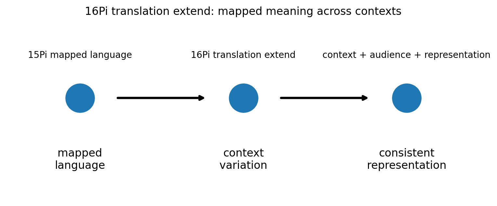
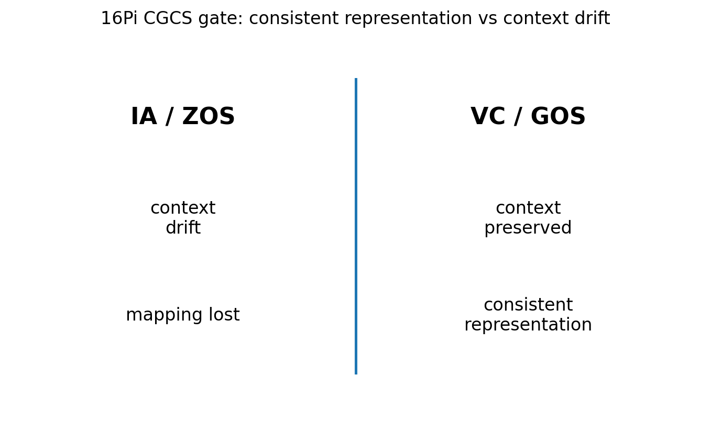

# 16 — 16Pi Translation Extend Notes

## Core statement

16Pi extends translation across contexts, audiences, and representations.

## Translation triplet

- 15Pi: expand measurable rate structure into mapped language
- 16Pi: extend translation across contexts, audiences, and representations
- 17Pi: resist translation collapse by preserving meaning in public language

## Translation extension

16Pi extends translation across contexts, audiences, and representations.

A valid translation:
- preserves measured mapping
- states context
- respects audience without changing measurement meaning
- keeps representation consistent

An invalid translation:
- loses mapping
- changes meaning by audience
- hides representation boundary
- replaces measured meaning with interpretation drift

## Figures

### Translation extension

### CGCS gate (VC/GOS vs IA/ZOS)

## Results

### Metadata
- [16_16Pi_metadata.json](../results/16_16Pi_metadata.json)

### Claim scoring
- [16_16Pi_claims.json](../results/16_16Pi_claims.json)
- [16_16Pi_claims.csv](../results/16_16Pi_claims.csv)

### Manifest
- [16_16Pi_manifest.json](../results/16_16Pi_manifest.json)

## Template use

This notebook should be cloned for later Pi stages. Keep the same output pattern:

- docs/*.md for human-readable bridge notes
- results/*.json and results/*.csv for machine-readable claim scoring
- results/*_manifest.json for output inventory
- figures/*.png for site, paper, and seminar visuals
- math/*.tex for formal paper-ready equations

## Translation boundary

16Pi is grammar, not application.

Photons, CO2, O2, carbon cycle, climate claims, and public-language examples should be added in bridge docs or later notebooks, not hard-coded into 16Pi.

## High-CGCS 16Pi framing

A valid translation remains consistent across contexts, audiences, and representations.

## Low-CGCS 16Pi collapse

A translation can stay valid even when mapping context is lost.
