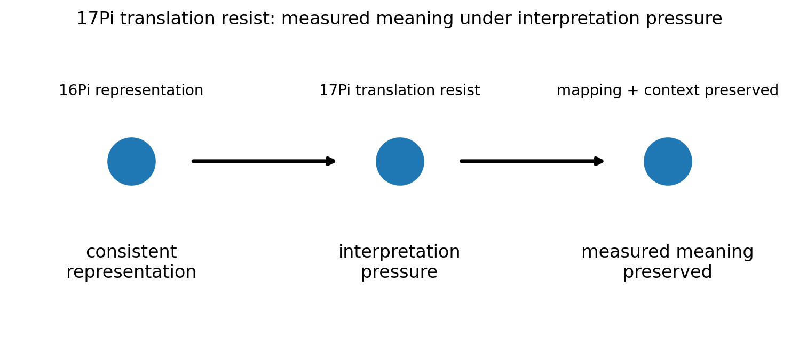
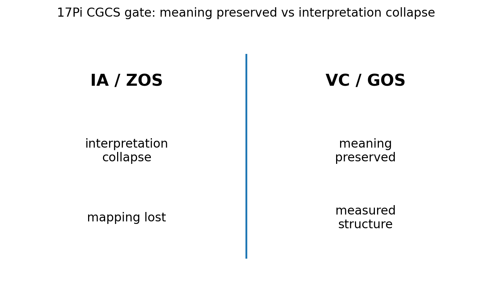

# 17 — 17Pi Translation Resist Notes

## Core statement

17Pi preserves measured meaning under interpretation pressure.

## Translation triplet

- 15Pi: expand measurable rate structure into mapped language
- 16Pi: extend translation across contexts, audiences, and representations
- 17Pi: resist translation collapse by preserving meaning in public language

## Translation resistance

17Pi completes the translation triplet.

A valid public translation:
- preserves mapped quantities
- preserves context
- preserves representation boundary
- keeps measured meaning recoverable

An invalid public translation:
- loses mapping
- changes meaning under interpretation pressure
- hides context
- replaces measured structure with persuasive framing

## Figures

### Translation resistance

### CGCS gate (VC/GOS vs IA/ZOS)

## Results

### Metadata
- [17_17Pi_metadata.json](../results/17_17Pi_metadata.json)

### Claim scoring
- [17_17Pi_claims.json](../results/17_17Pi_claims.json)
- [17_17Pi_claims.csv](../results/17_17Pi_claims.csv)

### Manifest
- [17_17Pi_manifest.json](../results/17_17Pi_manifest.json)

## Template use

This notebook should be cloned for later Pi stages. Keep the same output pattern:

- docs/*.md for human-readable bridge notes
- results/*.json and results/*.csv for machine-readable claim scoring
- results/*_manifest.json for output inventory
- figures/*.png for site, paper, and seminar visuals
- math/*.tex for formal paper-ready equations

## Translation boundary

17Pi is grammar, not application.

Photons, CO2, O2, carbon cycle, climate claims, and public-language examples should be added in bridge docs or later notebooks, not hard-coded into 17Pi.

## High-CGCS 17Pi framing

A valid public translation preserves measured meaning under interpretation pressure.

## Low-CGCS 17Pi collapse

Public interpretation can replace measured meaning when language is persuasive.
